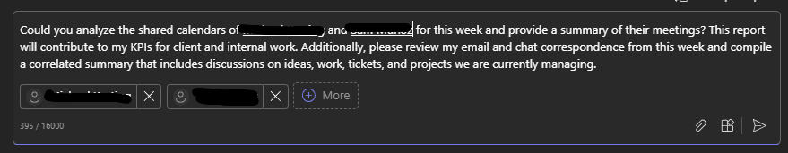

# 🚀 Analyze Calendars and Chats and Give KPIs for Reporting 📆

## Summary 📜

This is a prompt that will analyze users that have shared calendars with you and provide a summary of their meetings and then review email and chat correspondence with summary.

## Prompt 💡

Could you analyze the shared calendars of /userA and /userB for this week and provide a summary of their meetings? This report will contribute to my KPIs for client and internal work. Additionally, please review my email and chat correspondence from this week and compile a correlated summary that includes discussions on ideas, work, tickets, and projects we are currently managing.

## Description ℹ️

This is a prompt that will analyze users that have shared calendars with you and provide a summary of their meetings and then review email and chat correspondence with summary.

## Contributors 👨‍💻

[Brad Chaney](https://github.com/Goonie78)

## Version history 📋

Version|Date|Comments
-------|----|--------
1.0|September 27, 2024|Initial release

## Instructions 📝

1. Make sure you have copilot for Microsoft 365 in your tenant
2. Go to Copilot app in Teams
3. Copy paste the above prompt
4. IF you want, you can also modify the prompt to show the list of meetings for next week or for a specific date range

### Improvise Usage 🚀

You can add more information to the prompt if needed to show details in the table. You can modify the meeting dates / range  in the prompt so that you can get the details of the meeting for the range which you are looking for. Currently, the prompt is showing the details of the meeting for the current week.

## Prerequisites 📦

* [Copilot for Microsoft 365](https://developer.microsoft.com/microsoft-365/dev-program)

## Help 💁

We do not support samples, but this community is always willing to help, and we want to improve these samples. We use GitHub to track issues, which makes it easy for  community members to volunteer their time and help resolve issues.

You can try looking at [issues related to this sample](https://github.com/pnp/copilot-prompts/issues?q=label%3A%22sample%3A%20YOUR-SAMPLE-NAME%22) to see if anybody else is having the same issues.

If you encounter any issues using this sample, [create a new issue](https://github.com/pnp/copilot-prompts/issues/new).

Finally, if you have an idea for improvement, [make a suggestion](https://github.com/pnp/copilot-prompts/issues/new).

## Disclaimer

**THIS CODE IS PROVIDED *AS IS* WITHOUT WARRANTY OF ANY KIND, EITHER EXPRESS OR IMPLIED, INCLUDING ANY IMPLIED WARRANTIES OF FITNESS FOR A PARTICULAR PURPOSE, MERCHANTABILITY, OR NON-INFRINGEMENT.**

